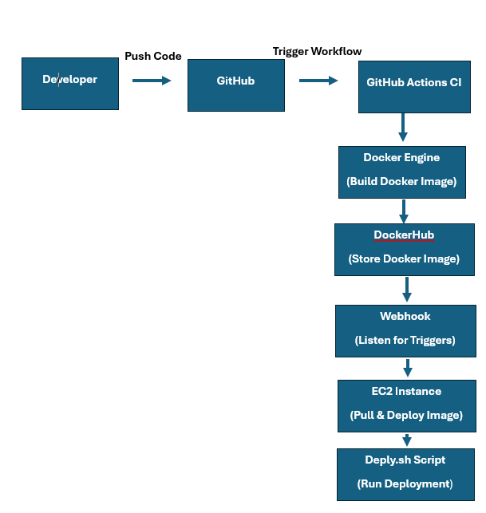

# CD Project: CD

## CD Project Overview

This project aims to explore and implement a Continuous Deployment (CD) pipeline for our Angular application using GitHub Actions and Docker.

The purpose of this project is to implement semantic versioning for Docker Images, automate the deployment process for efficiency, and use GitHub Actions and Docker Hub to create a CD Workflow.

### Tools that will be used

- **GitHub Actions**: Utilized to create and trigger workflows that will build and tag Docker images.
- **Docker**: This will be used to build and manage containers for our application.
- **Docker Hub**: This will be utilized to host the Docker Images.
- **EC2 Instance**: This AWS instance will be utilized to test the deployment of the application.
- **adnanh/webook**: This will be utilized to automate script execution within the EC2 instance.

### How to Generate and Push a Tag in GIT

If you are wanting to commit with semantic versioning and push it to a specified repository, please use the following steps.

1. Create a new tag using semantic versioning

```bash
git tag v1.0.0
```

Replace the `1.0.0` with the appropriate version number (major.minor.patch).

2. Push the tag to the specific repository

```bash
git push origin v1.0.0
```

This will activate the GitHub Actions workflow if the tag matches the pattern (v*.*.*).

#### Behavior of the GitHub Workflow

## When does it activate?

The workflow is triggered when a tag is pushed to the specified repository. This happens when and if the tags given match the pattern "v*.*.*" that is located in the GitHub workflow.

### What does this do?

The workflow:
- Checks out the code from the repository
- Logs into Docker Hub
- Sets up QEMU and Docker Buildx to allow cross-platform builds
- Extracts metadata from Git
- Builds and pushes the Docker images

#### Part 2

## Instance Information

- **Public IP**: 54.235.36.165
- **Operating System**: Ubuntu Server t2.Small

### How to Install Docker on an AWS Instance

To install Docker on an Ubuntu instance, please run the following commands:

```bash
sudo apt update
sudo apt install -y docker.io
sudo systemctl start docker
sudo systemctl enable docker
```

### Bash Script for Deployment

**Purpose**:

The purpose of the bash script is to pull the latest Docker image from Docker Hub, stop and remove any existing containers, and start a new container from the latest image.

### Description of Script Tasks

1. Pull the latest Docker image from GitHub
2. Stop and remove the existing container if it's running
3. Start a new container using the updated image
4. Ensure the container runs properly

### Location on Instance Filesystem

- **File path**: /home/ubuntu/webhook/deploy.sh

### Link to deploy script

- **Link**: [deploy-script.sh](https://github.com/WSU-kduncan/f24cicd-EricNichols25/blob/main/Deployment/deploy.sh)

#### Purpose of Installing adnanh's Webhook

The purpose of the webhook is to trigger the bash deployment script automatically when a webhook message is received. This allows us to maintain continuous deployment by ensuring that the latest code is pulled and run whenever changes occur.

### How to Install adnanh's Webhook

1. Install the webhook by running the following commands:

```bash
wget https://github.com/adnanh/webhook/releases/download/v2.8.0/webhook_linux_amd64 -O /usr/local/bin/webhook
chmod +x /usr/local/bin/webhook
```

### Creating the Webhook Configuration File

To create the Webhook Configuration file, please follow these steps:

1. Create a JSON file titled "hooks.json" in the /home/ubuntu/deployment directory.
2. Once created, the contents of the file should look similar to this example:

```json
[
  {
    "id": "deploy",
    "execute-command": "/home/ubuntu/deployment/deploy-script.sh",
    "command-working-directory": "/home/ubuntu/deployment"
  }
]
```

- **Location on filesystem**: /home/ubuntu/deployment
- **Link to file**: [hooks.json](https://github.com/WSU-kduncan/f24cicd-EricNichols25/blob/main/Deployment/hooks.json)

### How to Start the Webhook Listener (Without Service)

To start the Webhook Listener manually, please run the following command:

```bash
webhook -hooks /home/ubuntu/deployment/hooks.json -port 9000
```

## Testing the Listener

To test that the listener is working successfully, send a POST request to the Webhook by running the following command:

```bash
curl -X POST http://localhost:9000/hooks/deploy
```

## Monitoring Webhook Logs

Another way to test that the Webhook logs are running correctly is by viewing the logs. To do that, run the following command:

```bash
tail -f /var/log/syslog | grep webhook
```

#### What to Look for in the Docker Process Views

Run the following command to see if the new container is running successfully:

```bash
docker ps
```

#### Configuring GitHub or Docker Hub to Message the Listener

Configure a webhook in your GitHub Repository under **Settings > Webhooks** and fill in "http://<instance public-ip>:9000/hooks/deploy"

#### Webhook Service File

### Purpose of the Service File

The service file ensures that the webhook listener starts automatically when the instance boots up.

The service file should be located in the following directory: "/etc/system/webhook.service"

Your service file should look something similar to this:

```ini
[Unit]
Description=Webhook listener
After=network.target

[Service]
ExecStart=/usr/local/bin/webhook -hooks /home/ubuntu/deployment/hooks.json -port 9000
Restart=always
User=ubuntu

[Install]
WantedBy=multi-user.target
```

- **Link to service file**: [webhooks.service.txt](https://github.com/WSU-kduncan/f24cicd-EricNichols25/blob/main/Deployment/webhooks.service.txt)

### Reloading the Service

After making changes to the service file, you will need to reload the system configuration. To do this, please run the following command:

```bash
sudo systemctl daemon-reload
```

### Starting and Enabling the Service

To start and enable the service, please run the following commands:

```bash
sudo systemctl start webhook.service
sudo systemctl enable webhook.service
```

#### Part 3 Diagramming

Here is a diagram showcasing the flow of the project:



#### Part 4 Demonstration

I will be skipping the demonstration section. I had extreme difficulty with this project and do not believe that I have all functioning parts to be able to earn complete credit on the demonstration section.

#### Sources

## Sources Used for Part 1

- **GitHub Actions**: This source was utilized to help with GitHub Actions: [https://docs.github.com/en/actions](https://docs.github.com/en/actions)
- **Semantic Versioning**: I utilized class recordings to help further my understanding of semantic versioning: [https://pilot.wright.edu/d2l/common/dialogs/quickLink/quickLink.d2l?ou=737581&type=lti&rcode=wrightstate-2517743&srcou=6605&launchFramed=1&framedName=Webex](https://pilot.wright.edu/d2l/common/dialogs/quickLink/quickLink.d2l?ou=737581&type=lti&rcode=wrightstate-2517743&srcou=6605&launchFramed=1&framedName=Webex)

## Sources Used for Part 2

- **Installation and Setup**: [https://docs.docker.com/engine/install/ubuntu/](https://docs.docker.com/engine/install/ubuntu/)
- **Installation and Setup**: [https://docs.aws.amazon.com/AWSEC2/latest/UserGuide/concepts.html](https://docs.aws.amazon.com/AWSEC2/latest/UserGuide/concepts.html)
- **Bash Script Creation and Purpose**: [https://www.gnu.org/software/bash/manual/bash.html](https://www.gnu.org/software/bash/manual/bash.html)
- **Docker and GitHub Integration**: [https://pilot.wright.edu/d2l/common/dialogs/quickLink/quickLink.d2l?ou=737581&type=lti&rcode=wrightstate-2517743&srcou=6605&launchFramed=1&framedName=Webex](https://pilot.wright.edu/d2l/common/dialogs/quickLink/quickLink.d2l?ou

