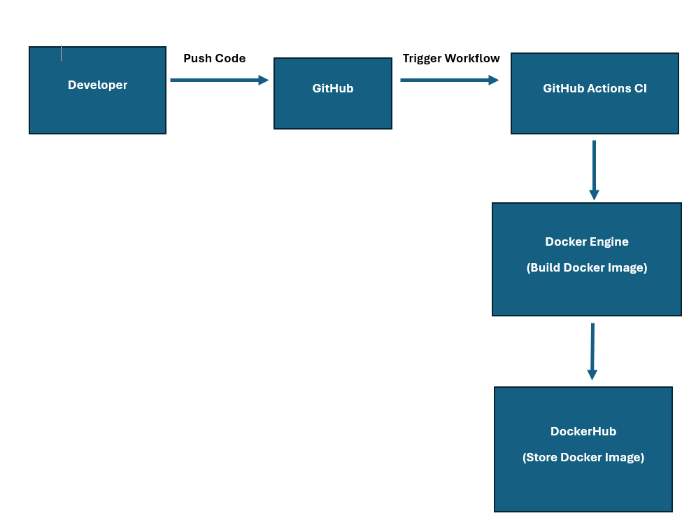

# CI Project: CI

## CI Project Overview

This project will demonstrate how to run a Web page in a container by using docker. By utilizing docker to create a container, the application/web page can run consistently across different operating systems and environments! The tools that we will be using in this project include: 

- **Docker**:This will be used to create containers and manage the application.
- **DockerHub**: Used as an easy way to store and share the container image publicly.
- **GitHub**: This will be used to manage and share the project source code publicly.

## Containerizing Your Application

#### Installing docker and Dependencies on an EC2 Instance
To install Docker and it's dependencies on an EC2 Instance, please refer to the steps listed below.

1. SSH into your EC2 Instance
2. Update package information by running ``bash sudo apt update
3. Install Docker by running the following command: ``bash sudo apt install -y docker.io
4. Start the Docker service by running these two commands:
	``bash sudo systemctl start docker
	``bash sudo systemctl enable docker
5. Verify the installation of docker by running: ``bash docker --version 

If for any reason you get stuck on the installation steps, you can utilize the docker installation guide found here: https://docs.docker.com/engine/install/

#### How to Build & Configure a Container (Without Building an Image)

1. Please navigate to the following GitHub repo where you can find the angular-bird.zip file: https://github.com/pattonsgirl/CEG3120/tree/main/Projects/Project4

2. Extract the Angular project (angular-bird.zip) into a folder. Please name that folder angular.site

3. On your EC2 instance, please run the following command in the terminal: ``bash docker docker run --rm -it -p 80:80 -v $(pwd)/angular-site:/usr/src/app node:18-alpine
   This command will use the node:18-alpine base image. It also mounts the angulr-site folder from your local machine to the container.

4. Once inside the container, you will need to manually install the dependencies and run the app. To do so, please run the following commands in the specified order:

``bash cd /usr/src/app
``bash npm install
``bash npm run build --prod
``npx http-server dist/angular-site -p 80

5. To verify if the application is running properly, you can open a browser and enter in the following: ``bash http://<your-system-ip>:80

#### Summary of Instructions Stated in the Repository Dockerfile

The base image "node:18-alphine" was chosen due to it's efficient Node.js runtime.

Working Directory: Application files will be copied to /usr/src/app

Commands:

"RUN npm install": Installs any necessary dependencies
"RUN npm build --prod": Builds the Angular project for production
"CMD:["npx", "http-server", "dist/angular-site", "-p", "80"]": This starts the application using the http-server

####How to Build an Image from the Repository Dockerfile

1. Navigate to the directory containing the Dockerfile
2. To Build the Docker image please run the following command: ``bash docker build -t angular-site-image.
3. To Run a container from the Built image, please run the following command: ``bash docker run -d -p 80:80 angular-site-image
 	The -d flag will run the container in the detached mode
	The -p 80:80 flag will map port 80 on your host to port 80 in the container
4. To verify that the container is running, please run the following command: ``bash docker ps
5. To view the application running in the container you can do the following:
	1. Open a browser and nvigate to http://EC2-Instance-Public-IP:80 replace "EC2-Instance-Public-IP" with the actual instance IP

## Working with Dockerhub

#### How to create a Public Repository in DockerHub

1. Navigate to https://DockerHub.com
2. Log into the site with your Dockerhub account. If you do not have one already create one.
3. After logging in, click on your profile in the right hand corner and select Repositories
4: Click the Create Repositor Name field and enter the name of your repository
5. Ensure that Public is selected, so that other accounts can view and access the repository
6. Click create to finalize the creation of your repository

####How to Authenticate with DockerHub via CLI Using DockerHub Credentials

1. Open a terminal or command prompt
2. Run the following command to log in to a DockerHub account from a terminal ``bash docker login
3. When prompted, please enter in your username and password to DockerHub. When successful, you will see a message confirming you've logged in

####How to Push Container Image to DockerHub

1. Tag your local image with the DockerHub repository URL: ``bash docker tag angular-site-image your-dockerhub-username/YOURLASTNAME-CEG3120
	Of course, you would replace "your-dockerhub-username with your actual DockerHub Username
2. Push the image to your DockerHub repository by runnung the following command: ``bash docker push <your-dockerhub-username>/YOURLASTNAME-CEG3120

####Link to your DockerHub Repository for this project:

After pushing the container image, you will want to provide the link to your DockerHub respotiory. The URL should look like the following:  ``bash https://hub.docker.com/repository/docker/%3Cyour-dockerhub-username%3E/YOURLASTNAME-CEG3120

#### Part 2

### Configuring GitHub Secrets

To utilize sensitive information like credentials in a secure manner on GitHub you will need to configure something called GitHub Secrets. To do this, please follow the steps listed out below:

1. Go to your GitHub repository
2. Click on the settings for that repository
3. In the left hand sidebar, select "Secrets and Variables" and then select "Actions".
4. Click "New repository secret"
5. Enter the name and Value of the secret for example
   DOCKERHUB_USERNAME: this will be your DockerHub Username
   DOCKER_TOKEN: This will be your DockerHub Access token that you have generated.

### Behavior of GitHub Workflow
The workflow automates the following tasks:

1. Build Docker image: when an item is pushed to the main branch, the workflow ill trigger and build the docker image from the repository's docker file
2. Log in to DockerHub: The workflow will log into DockerHub usin the username and token secrets.
3. Push Docker Image: When the image is built, it is tagged and pushed to the Dockerhub repository under the latest tag.

### Summary of What a User would need to change or configure based on using my own workflow

If a user wants to duplicate my project, they will need to look into changing the following:

1. GitHub secrets: They will need to replace "DOCKER_USERNAME" and "DOCKER_TOKEN" with the names of their own DockerHub Secrets.

2. DockerHub Image Name: The users will need to replace the image name with the name of their own DockerHub image name.

3. Branch Name: If the user has a different branch name than "main", they will need to update that as well.

#### Part 3

### Diagram of GitHub Workflow

####Sources:

### Part 1

Docker Official Documentation: This was utilized for Docker installation, dependencies, and Docker CLI commands https://docs.docker.com/ 

Node.js DOcker Official Image documentation: Ustilized for the node:18-alpine base image: https://hub.docker.com/_/node

Dockerhub Documentation: I utilized the following link for creating public repositories and how to push images to Dockerhub: https://docs.docker.com/docker-hub/

Angular CLI, Build Documentation, and http-server: I utilized class lecture recordings for these:  https://pilot.wright.edu/d2l/common/dialogs/quickLink/quickLink.d2l?ou=737581&type=lti&rcode=wrightstate-2517743&srcou=6605&launchFramed=1&framedName=Webex

### Part 2

For the GitHub Secrets section, I used the official GitHub Docs guide. I found that this was helpful in explaining how they work. https://docs.github.com/en/actions/security-for-github-actions/security-guides/using-secrets-in-github-actions

I had trouble understanding the syntax for the Work flow.yml file. I utilized the official Docs.github page, as well as recorded lecture by Professor Kayleigh Duncan.

https://docs.github.com/en/actions/writing-workflows/workflow-syntax-for-github-actions

(Insert link to recorded lecture)

For the Docker Hub Documentation section, to learn where the "Create Access Token" setting was, I utilized the official DockerHub support doc. I found that this easily provided the step by step process on how to create and manage an access token. I would like to make note that I referenced the steps in my step by step process to generate a token. However, I did my best to paraphrase in my own words. The link to that document can be found here:

https://docs.docker.com/security/for-developers/access-tokens/

I utilized the Docker Hub Docs web page to help with proper syntax on the "docker image push" command. I like to utilize the official docs web pages for Docker Hub. I find them straightforward and relatively helpful. The reason I used these for this project is because the information is helpful and straight forward. 

https://docs.docker.com/reference/cli/docker/image/push/

